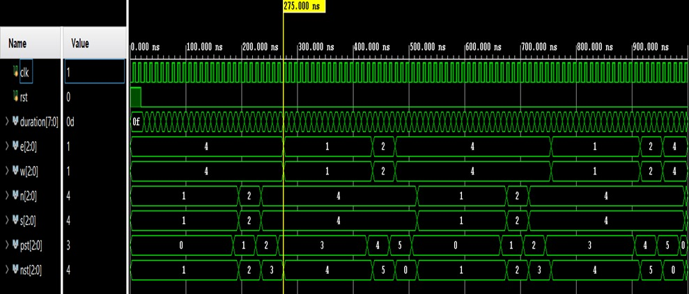

# Traffic Light Controller (FSM) - Verilog

## Overview

This project implements a Traffic Light Controller using Verilog HDL based on a Finite State Machine (FSM).
The design simulates traffic signal control at a four-way intersection, managing signal transitions for North-South and East-West directions.

---

## Features

* FSM-based design with 6 states (S0–S5)
* Controls traffic flow for two directions (NS and EW)
* Red, Yellow, Green signal encoding
* Timing control using counters
* Verilog testbench for functional verification

---

## Design Details

* Implemented as a synchronous FSM using clock and reset
* States represent traffic phases:

  * Green → Yellow → Red transitions
* Output encoding:

  * Red = 100
  * Yellow = 010
  * Green = 001
* Timing handled using cycle-based counters to simulate real-time delays
* State transitions controlled using present state (`pst`) and next state (`nst`)

---

## Operation

* Traffic alternates between North-South and East-West directions
* Each state holds for a defined duration
* Smooth transition sequence:

  * Green → Yellow → Red → Next direction
* Ensures no conflicting green signals between directions

---

## Testbench

* Generates clock signal using periodic toggling
* Applies reset to initialize FSM
* Uses `$monitor` to observe:

  * State transitions
  * Signal outputs (N, E, S, W)
  * Timing behavior
* Verifies correct sequencing of traffic lights

---

## Simulation

* Simulated using Vivado / QuestaSim
* Waveform confirms correct FSM transitions and timing control
* Output shows proper signal switching for all directions

---

## Tools Used

* Verilog HDL
* Xilinx Vivado
* QuestaSim

---

## Key Learning

* FSM design and implementation
* State transition logic
* Timing-based control systems
* Functional verification using testbench

---

## Waveform

---

## Author

Kotha Datta Sasank
